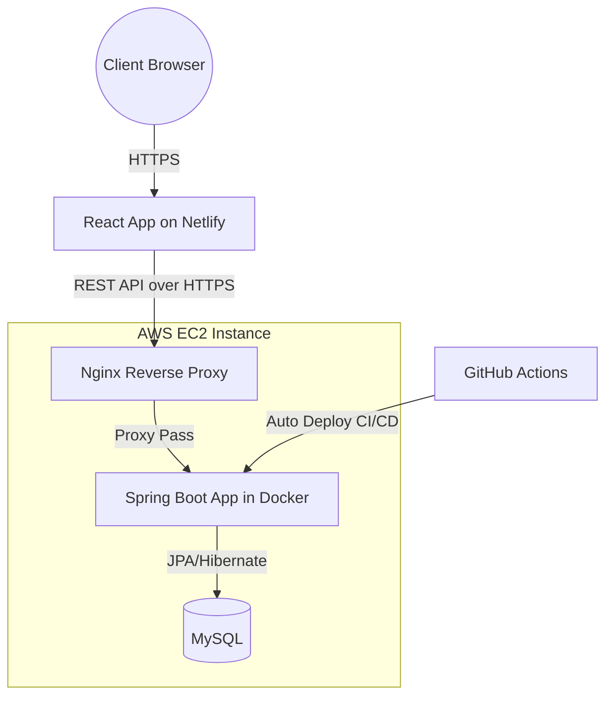

# Airline Booking Frontend - React Client for Booking System

A React-based frontend for the Airline Booking System.

This application provides the user interface for searching flights, creating bookings, and managing data, and is designed to work with a production-style Spring Boot backend.

**Live Frontend**:  
https://airline-booking.menglanyan.dev

**Live Backend Swagger UI**:  
https://airline-api.menglanyan.dev/swagger-ui/index.html

**Backend Repository**:  
https://github.com/menglanyan/airline-booking-system-backend

---

## Application Overview


This diagram shows how the frontend interacts with the backend service. The frontend is deployed on Netlify and communicates with the backend via REST APIs.

---

## Tech Stack

- React  
- Axios  
- React Hooks
- React Router

---

## Key Features

- Flight search with query parameters  
- Booking flow with passenger details  
- Pagination support for large datasets  
- Admin dashboard for managing flights and bookings  

---

## Integration with Backend

This frontend interacts with a backend API that provides:

- JWT-based authentication  
- role-based access control  
- concurrency-safe booking  
- idempotent booking requests  

All data is fetched from the backend via REST APIs using Axios.

---

## How to Run

```bash
git clone https://github.com/menglanyan/airline-booking-system-frontend.git
cd airline-booking-system-frontend
npm install
npm start
```
App runs on:  
http://localhost:3000  

---

## Notes

This project is part of a full-stack system.

The backend repository contains the main system design and engineering logic, including:
- booking reliability  
- API design  
- deployment pipeline  